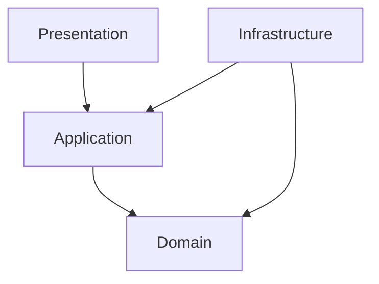
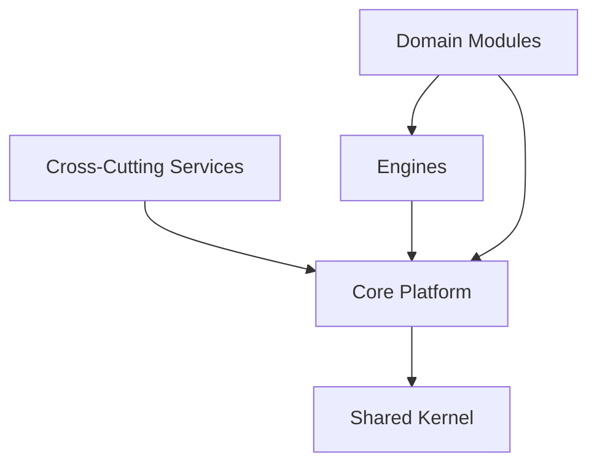

# Modelo Arquitetural da VERO Platform

## Controle do documento

| Campo | Valor |
|---|---|
| Identificador | VERO-CONST-001-CH05 |
| Documento mestre | VERO-CONST-001 |
| Pacote | 4 — Modelo Arquitetural |
| Versão | 0.4.0 |
| Estado | Draft — materializado para revisão |
| Autoridade | Arquiteto-Chefe |
| Responsável pela materialização | Engenharia Oficial |
| Data | 2026-07-27 |

## 1. Objetivo

Estabelecer o modelo conceitual obrigatório segundo o qual a VERO Platform organiza responsabilidades, camadas, núcleo arquitetural, grupos de módulos, comunicação e dependências.

## 2. Escopo

Este capítulo governa a organização lógica de toda a plataforma. Ele define fronteiras e direções permitidas, mas não especifica estrutura física de diretórios, frameworks, topologia de implantação, protocolos, tecnologias, esquemas ou contratos detalhados. Esses elementos pertencem ao Blueprint ou a ADRs aprovados.

## 3. Diretrizes Normativas

### 3.1 Camadas

A arquitetura deve distinguir quatro camadas conceituais:

- **Presentation:** recebe interações externas, valida aspectos de transporte, adapta entrada e saída e invoca casos de uso;
- **Application:** coordena casos de uso, transações, autorização contextual e interação entre domínio e portas, sem concentrar regras de negócio;
- **Domain:** contém modelos, agregados, entidades, value objects, serviços de domínio, invariantes, políticas e eventos de domínio;
- **Infrastructure:** implementa portas técnicas, persistência, mensageria, integrações, provedores e mecanismos operacionais.

A direção das dependências deve apontar para o domínio. Presentation depende de Application; Application depende de Domain; Infrastructure implementa abstrações definidas internamente e pode depender de Application e Domain. Domain não depende das demais camadas.

As setas representam dependências de código permitidas, não fluxo de execução. Fluxos de execução podem atravessar portas e adaptadores em ambos os sentidos sem inverter a direção das dependências.

### 3.2 Estrutura do núcleo

A plataforma deve organizar suas capacidades estruturais nos seguintes conjuntos:

- **Core Platform:** fundação comum que sustenta identidade, tenancy, configuração e capacidades essenciais de execução;
- **Shared Kernel:** conjunto mínimo, estável e governado de conceitos realmente compartilhados;
- **Cross-Cutting Services:** segurança, auditoria, observabilidade, notificações, arquivos, busca, agendamento e outras capacidades transversais;
- **Engines:** Event Platform, Lifecycle Engine, Workflow Engine, Business Rules Engine e Automation Engine;
- **Domain Modules:** bounded contexts que encapsulam capacidades do negócio.

AI Gateway e Integration Hub são componentes transversais do núcleo arquitetural. Eles mediam, respectivamente, acesso a IA e integrações externas, sem se apropriar das regras dos domínios.

O diagrama expressa relação conceitual de uso de capacidades públicas. Não autoriza acesso a implementações internas nem dependências circulares.

### 3.3 Organização dos módulos

Os módulos devem ser classificados em quatro grupos:

- **Core:** identidade, acesso, tenant, organização, usuário, workspace e demais capacidades essenciais de plataforma;
- **Platform:** engines, gateways e serviços estruturantes reutilizáveis;
- **Business:** capacidades pertencentes aos domínios empresariais;
- **Integrations:** adaptadores, conectores, Anti-Corruption Layers e contratos de fronteira com sistemas externos.

A classificação não reduz a autonomia dos módulos. Cada módulo deve declarar responsabilidade, propriedade de dados, contratos públicos, eventos publicados e consumidos, dependências permitidas e controles de acesso.

Core e Platform não podem depender de regras ou implementações específicas de Business. Business pode consumir contratos públicos de Core e Platform. Integrations deve depender de contratos internos e traduzir modelos externos; domínios não podem depender diretamente de fornecedores ou modelos externos.

### 3.4 Comunicação

A comunicação deve adotar o mecanismo mais simples que preserve limites, consistência e requisitos operacionais:

- **síncrona:** para comandos, consultas ou validações que exijam resposta imediata, por interfaces públicas ou APIs;
- **assíncrona:** para propagação de fatos, desacoplamento temporal, resiliência e processamento independente, por eventos governados;
- **eventos:** representam fatos imutáveis e não podem ser utilizados como chamadas remotas disfarçadas;
- **contratos públicos:** são a única superfície autorizada entre módulos;
- **APIs:** devem ser explícitas, versionadas, seguras, observáveis e compatíveis com a política de evolução.

Acesso direto a tabelas, repositórios, entidades, serviços internos ou modelos de persistência de outro módulo é proibido. Consistência distribuída entre módulos deve ser tratada por contratos e padrões aprovados, nunca por quebra de encapsulamento.

### 3.5 Dependências entre camadas e módulos

As dependências permitidas obedecem simultaneamente às regras de camada e de módulo.

| Origem | Dependência permitida | Dependência proibida |
|---|---|---|
| Presentation | Application e contratos públicos de entrada | Domain interno, persistência e providers |
| Application | Domain e portas internas | Detalhes concretos de Infrastructure |
| Domain | Seu próprio domínio e Shared Kernel aprovado | Presentation, Application, Infrastructure, frameworks e fornecedores |
| Infrastructure | Portas de Application e abstrações de Domain | Governar regras de negócio |
| Core | Shared Kernel e contratos estruturais aprovados | Business e Integrations concretas |
| Platform | Core e contratos estruturais aprovados | Implementações específicas de Business |
| Business | Contratos públicos de Core, Platform e outros módulos autorizados | Estruturas internas ou dados de outro módulo |
| Integrations | Contratos internos e adaptadores aprovados | Contaminação direta do domínio por modelos externos |

Dependências circulares são vedadas em qualquer nível. O Shared Kernel deve permanecer mínimo e não pode ser utilizado como depósito de conveniência para contornar fronteiras.

### 3.6 Contratos e propriedade

Cada dado, regra, API e evento deve possuir um módulo proprietário. Somente o módulo proprietário pode alterar sua representação interna. Consumidores dependem de contratos públicos, não de detalhes internos.

Mudanças em contratos públicos devem respeitar versionamento, compatibilidade, depreciação, observabilidade e comunicação de impacto. Contratos críticos devem possuir critérios verificáveis e rastreabilidade com requisitos, ADRs e testes.

## 4. Regras Obrigatórias

1. Toda capacidade deve possuir camada e módulo proprietários identificáveis.
2. Domain deve permanecer independente de Presentation, Application, Infrastructure, frameworks e fornecedores.
3. Presentation não pode acessar persistência ou regras internas de domínio diretamente.
4. Application coordena casos de uso, mas não deve absorver invariantes pertencentes ao Domain.
5. Infrastructure implementa portas; não define o comportamento normativo do negócio.
6. Comunicação entre módulos deve ocorrer somente por contratos públicos aprovados.
7. Acesso direto aos dados ou estruturas internas de outro módulo é proibido.
8. Dependências circulares entre camadas, módulos ou componentes são proibidas.
9. Core e Platform não podem depender de módulos Business específicos.
10. Integrations deve proteger o domínio por adaptadores e Anti-Corruption Layers quando necessário.
11. Eventos não podem ser usados para ocultar acoplamento síncrono ou transferir responsabilidade de domínio.
12. Shared Kernel deve ser mínimo, estável, versionado e aprovado.
13. Exceções exigem ADR, justificativa, análise de impacto e aprovação conforme o princípio de Evolução Arquitetural Controlada.
14. O Blueprint deve detalhar este modelo sem alterar sua direção normativa.

## 5. Justificativa Arquitetural

O modelo combina centralidade do domínio, separação de responsabilidades, autonomia modular e unidade operacional. Ele permite que a VERO evolua como Modular Monolith com fronteiras fortes, reduz acoplamento tecnológico, protege contratos e prepara crescimento futuro sem impor distribuição prematura.

## 6. Impactos na Plataforma

- **Engenharia:** estrutura de código, testes e revisões devem verificar camadas e fronteiras.
- **Domínio:** regras e invariantes permanecem protegidas de detalhes técnicos.
- **Dados:** propriedade e acesso são definidos por módulo e tenant.
- **Integrações:** fornecedores são isolados por adaptadores e ACLs.
- **Eventos e APIs:** contratos públicos passam a ser superfícies governadas.
- **Engines e serviços transversais:** capacidades comuns são consumidas sem absorver responsabilidades de negócio.
- **Segurança e observabilidade:** contexto, autorização, telemetria e auditoria atravessam as camadas por contratos explícitos.
- **Evolução:** mudanças estruturais permanecem sujeitas à Constituição e a ADRs.

## 7. Referências Cruzadas

- [Fundamentos e Escopo](01-FUNDAMENTOS-E-ESCOPO.md);
- [Princípios Arquiteturais](02-PRINCIPIOS-ARQUITETURAIS.md);
- [Governança e Autoridade](03-GOVERNANCA-E-AUTORIDADE.md);
- [Missão, Visão e Valores](04-MISSAO-VISAO-E-VALORES.md);
- [Desdobramentos para o Blueprint](DESDOBRAMENTOS-PARA-O-BLUEPRINT.md).

O Blueprint deverá detalhar topologia física, estrutura de projetos, portas e adaptadores, composição do núcleo, catálogo de módulos, matriz completa de dependências, padrões síncronos e assíncronos, governança de contratos e testes arquiteturais.

## 8. Histórico do Capítulo

| Versão | Data | Alteração | Estado |
|---|---|---|---|
| 0.4.0 | 2026-07-27 | Modelo conceitual de camadas, núcleo, módulos, comunicação e dependências materializado | Draft para revisão |
