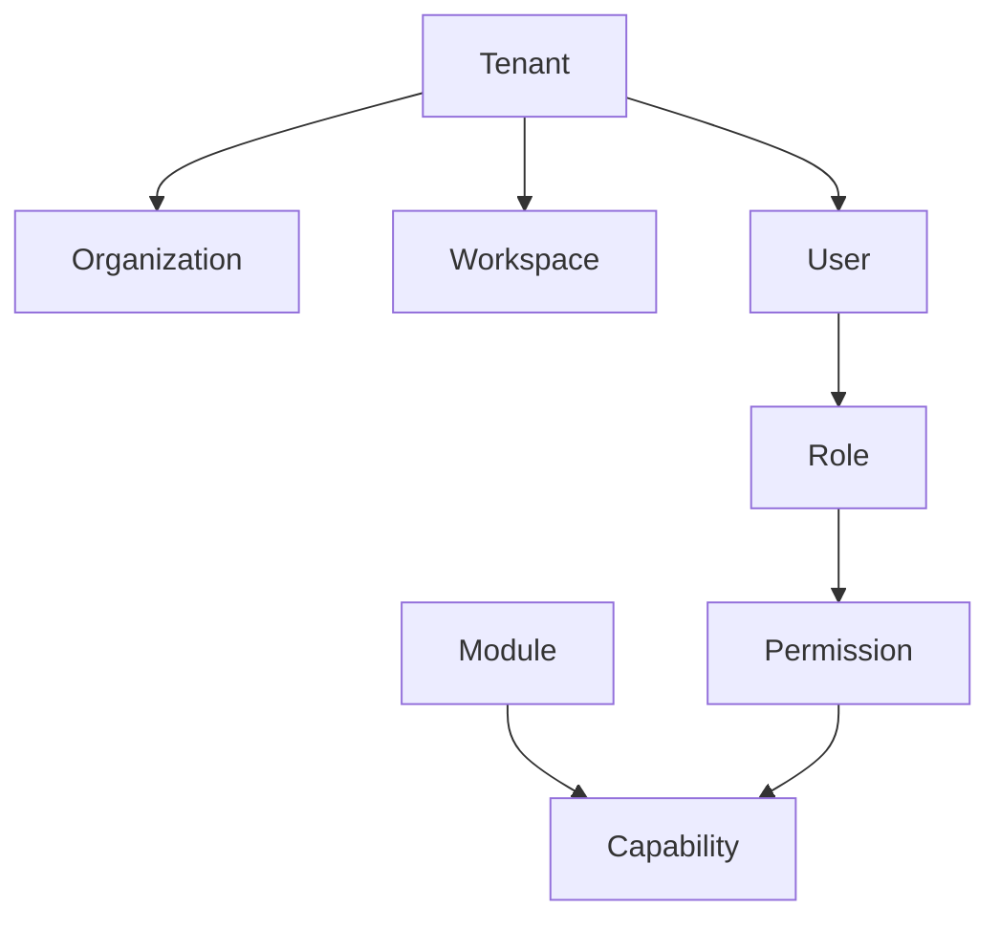

# VERO Platform — Canonical Domain Model

## Controle do documento

| Campo | Valor |
|---|---|
| Identificador | VERO-CDM-001 |
| Título | Canonical Domain Model da VERO Platform |
| Versão | 0.1.0 |
| Estado | Approved |
| Autoridade | Arquiteto-Chefe |
| Responsável pela materialização | Engenharia Oficial |
| Data | 2026-07-27 |
| Documento superior | VERO-CONST-001 v1.0.0 — Approved |
| Localização oficial | `docs/03-Domain/VERO-CDM-001-CANONICAL-DOMAIN-MODEL.md` |

## 1. Objetivo

Estabelecer a linguagem canônica dos conceitos fundamentais da VERO Platform e definir, para cada conceito, sua responsabilidade, seus relacionamentos, suas regras, seus limites e suas dependências.

Este documento fornece uma base semântica comum para o Blueprint, ADRs, contratos públicos, módulos Core e Platform e futuras modelagens de domínio. Ele não substitui a Constituição Arquitetural e não autoriza implementação.

## 2. Autoridade e precedência

Este documento deriva da Constituição Arquitetural `VERO-CONST-001 v1.0.0` e deve ser interpretado segundo a precedência documental oficial:

1. Constituição Arquitetural;
2. Blueprint aprovado;
3. ADRs vigentes;
4. Canonical Domain Model aprovado;
5. Engineering Playbook e documentos especializados;
6. código e implementação.

Em caso de conflito, o documento superior prevalece. Lacunas ou ambiguidades com impacto arquitetural não podem ser resolvidas por implementação implícita; devem ser encaminhadas ao processo formal de decisão.

## 3. Escopo

O escopo deste documento está restrito aos conceitos estruturais de tenancy, identidade, autorização, modularidade, eventos e padrões táticos de Domain-Driven Design.

Estão explicitamente fora do escopo:

- módulos de negócio, incluindo CRM, Financeiro, Produção, Compras, Estoque, Vendas, Fiscal e RH;
- processos, workflows e automações de negócio;
- regras empresariais específicas;
- modelos de persistência, tabelas, schemas e tecnologias;
- endpoints, DTOs, protocolos e formatos físicos de mensagens;
- topologia de implantação;
- cardinalidades e ciclos de vida não estabelecidos pela Constituição ou pelo Blueprint;
- decisões de implementação.

## 4. Regras gerais do modelo

1. O domínio é independente de frameworks, persistência, transporte, filas e fornecedores.
2. Toda operação tenant-aware exige contexto de Tenant explícito, validado e autorizado.
3. Todo conceito possui um proprietário e somente pode ser consumido por contratos públicos aprovados.
4. Estruturas internas, modelos de persistência e detalhes de implementação não integram o modelo canônico.
5. Identidades devem ser estáveis e não devem incorporar significado de negócio mutável.
6. Invariantes são protegidas pelo Aggregate Root responsável.
7. Referências entre Aggregates ocorrem por identidade, salvo decisão superior explícita.
8. Domain Events e Integration Events representam fatos imutáveis ocorridos, não comandos.
9. Shared Kernel deve permanecer mínimo, estável, versionado e governado.
10. Dependências circulares são proibidas.

## 5. Visão conceitual

O diagrama apresenta relações semânticas gerais. Ele não define cardinalidades físicas, propriedade de tabelas nem estratégia de persistência.

## 6. Conceitos fundamentais da plataforma

### 6.1 Tenant

**Definição**

Fronteira lógica primária de isolamento, segurança, autorização, configuração, dados e operação na VERO Platform.

**Responsabilidade**

Estabelecer o contexto soberano no qual capacidades tenant-aware são executadas e no qual organizações, workspaces, acessos, configurações e dados são isolados.

**Relacionamentos**

- delimita o contexto de Organization, Workspace, Role, Permission, Module e Capability quando aplicável;
- autoriza a participação de User por associação explícita;
- fornece contexto obrigatório para eventos, políticas e operações tenant-aware;
- pode atuar como Aggregate Root de seu próprio ciclo de vida, sem absorver ciclos de vida de outros Aggregates.

**Regras**

- deve possuir identidade única, estável e não reutilizável;
- deve ser resolvido e autorizado antes de qualquer operação tenant-aware;
- seu contexto deve ser propagado de forma confiável entre camadas, chamadas e eventos;
- acesso entre tenants exige capacidade administrativa explícita, autorização reforçada e auditoria;
- desativação ou mudança de estado não pode violar retenção, auditoria ou integridade referencial.

**Limites**

- não representa automaticamente uma empresa, estabelecimento, workspace ou usuário;
- não contém regras de módulos de negócio;
- não autoriza acesso por mera existência;
- não define, neste documento, estratégia física de isolamento ou cardinalidade de Organizations e Workspaces.

**Dependências**

- depende somente de Value Objects, políticas e contratos do Shared Kernel aprovados;
- não depende de módulos Business, Infrastructure, frameworks ou fornecedores.

### 6.2 Organization

**Definição**

Representação canônica de uma unidade institucional reconhecida pela plataforma dentro de um contexto de Tenant.

**Responsabilidade**

Expressar identidade organizacional, estado e referências institucionais necessárias às capacidades Core, sem incorporar processos específicos de negócio.

**Relacionamentos**

- existe sob o contexto de um Tenant;
- pode contextualizar Workspaces, Users, Roles e Policies por contratos explícitos;
- pode ser referenciada por identidade por outros Aggregates autorizados;
- não substitui Tenant nem Workspace.

**Regras**

- deve possuir identidade estável dentro do contexto autorizado;
- toda operação deve preservar o Tenant ao qual a Organization está vinculada;
- mudanças de estado devem respeitar invariantes, auditoria e referências ativas;
- nomes e atributos descritivos não podem ser usados como identidade técnica.

**Limites**

- não modela estruturas societárias, filiais, departamentos ou unidades operacionais específicas sem extensão aprovada;
- não contém dados ou regras de CRM, Financeiro, RH, Fiscal ou outros módulos Business;
- não define hierarquia entre Organizations neste documento.

**Dependências**

- depende do contexto de Tenant e de Value Objects canônicos;
- não depende de Workspace, módulos Business ou implementações de Infrastructure para expressar suas invariantes.

### 6.3 Workspace

**Definição**

Contexto lógico de colaboração, configuração e uso de capacidades da plataforma, sempre subordinado a um Tenant.

**Responsabilidade**

Delimitar um espaço operacional no qual Users exercem Roles, Modules expõem Capabilities e Policies aplicam regras contextuais.

**Relacionamentos**

- pertence ao contexto de um Tenant;
- pode ser associado a uma Organization quando a modelagem aprovada exigir;
- recebe participação de Users por associação explícita;
- pode delimitar o escopo de Roles, Permissions, Modules, Capabilities e Policies.

**Regras**

- deve possuir identidade estável e Tenant explícito;
- não pode agregar dados ou acessos de tenants distintos;
- associação com Organization, quando existente, deve preservar o mesmo Tenant;
- ativação e desativação devem respeitar acessos, auditoria e recursos vinculados.

**Limites**

- não é sinônimo de Tenant, Organization, módulo ou ambiente de implantação;
- não possui regras específicas de negócio;
- não define neste documento sua cardinalidade em relação a Organization ou User.

**Dependências**

- depende de Tenant e de Value Objects canônicos;
- pode ser avaliado por Policies e referenciado por autorização;
- não depende de módulos Business nem de detalhes de Infrastructure.

### 6.4 User

**Definição**

Identidade humana ou identidade de usuário reconhecida pela plataforma para participação autenticada e autorizada em contextos permitidos.

**Responsabilidade**

Representar o sujeito ao qual credenciais externas, participação contextual, Roles, Permissions efetivas e ações auditáveis podem ser associadas.

**Relacionamentos**

- participa de Tenant, Organization e Workspace somente por associações explícitas e autorizadas;
- recebe Roles em escopos definidos;
- obtém Permissions efetivas por Roles e Policies;
- é ator de ações, eventos e registros de auditoria quando aplicável.

**Regras**

- deve possuir identidade estável, distinta de e-mail, nome ou credencial externa;
- autenticação não implica autorização;
- participação em um Tenant não concede acesso automático a outro;
- ações devem respeitar Least Privilege, contexto e políticas vigentes;
- bloqueio ou desativação deve impedir novas ações sem apagar fatos históricos.

**Limites**

- não armazena regras de autenticação de fornecedor;
- não é proprietário de Permissions globais por padrão;
- não representa cliente, funcionário, fornecedor ou outro ator de negócio sem modelagem específica futura;
- não incorpora dados de perfil pertencentes a módulos Business.

**Dependências**

- depende de Value Objects de identidade e estado e de contratos de associação aprovados;
- autorização depende de Role, Permission e Policy;
- não depende de frameworks de identidade ou providers externos no domínio.

### 6.5 Role

**Definição**

Conjunto nomeado e governado de Permissions atribuído a Users dentro de um escopo autorizado.

**Responsabilidade**

Simplificar e padronizar a concessão de acesso, preservando Least Privilege, separação de responsabilidades e auditabilidade.

**Relacionamentos**

- agrupa Permissions;
- é atribuída a User em contexto de Tenant e, quando aplicável, de Organization ou Workspace;
- é avaliada por Policies;
- pode referenciar Capabilities por meio das Permissions correspondentes.

**Regras**

- deve possuir escopo explícito;
- deve conceder somente Permissions necessárias à finalidade declarada;
- alterações devem ser auditáveis e produzir efeito conforme política de consistência aprovada;
- Roles não podem contornar Policies obrigatórias;
- atribuição e revogação exigem autorização própria.

**Limites**

- não é identidade, cargo empresarial ou grupo organizacional por definição;
- não executa ações;
- não substitui Permission nem Policy;
- não contém regras específicas de módulos Business no núcleo canônico.

**Dependências**

- depende de Permission, Tenant e do escopo contextual aplicável;
- não depende de implementações de autenticação, persistência ou interface.

### 6.6 Permission

**Definição**

Autorização atômica e nomeada para executar uma ação sobre um recurso ou Capability em um escopo definido.

**Responsabilidade**

Expressar o vocabulário mínimo de acesso utilizado por Roles e Policies para decisões de autorização.

**Relacionamentos**

- compõe Roles;
- referencia uma ação e um alvo, recurso ou Capability;
- é avaliada em conjunto com User, Tenant, contexto e Policy;
- pertence ao módulo proprietário da ação protegida ou a contrato Core aprovado.

**Regras**

- deve possuir semântica explícita, estável e auditável;
- concessão deve observar Least Privilege e negação por padrão;
- não pode produzir acesso fora do Tenant ou escopo autorizado;
- mudanças incompatíveis exigem versionamento e migração;
- a mera existência de uma Permission não concede acesso a um User.

**Limites**

- não representa uma decisão completa de autorização;
- não contém estado de sessão, credenciais ou regra de autenticação;
- não substitui Capability, Role ou Policy.

**Dependências**

- depende do contrato público do recurso ou Capability protegido;
- é consumida por Role e Policy;
- não depende de UI, transporte ou persistência.

### 6.7 Module

**Definição**

Unidade arquitetural coesa, com responsabilidade explícita, fronteira verificável, propriedade de dados e superfície pública governada.

**Responsabilidade**

Encapsular uma capacidade Core, Platform, Business ou Integration e proteger seus modelos, regras, dados e implementações internas.

**Relacionamentos**

- oferece uma ou mais Capabilities;
- possui contratos públicos, eventos publicados e consumidos e dependências declaradas;
- pode consumir contratos públicos de outros Modules quando permitido;
- contém Aggregates, Services, Repositories, Factories, Specifications e eventos sob sua propriedade.

**Regras**

- deve declarar responsabilidade, proprietário, dados, contratos e dependências;
- comunicação externa ocorre apenas por APIs, serviços de aplicação expostos ou contratos de eventos aprovados;
- acesso direto a tabelas, repositórios, entidades ou serviços internos de outro Module é proibido;
- dependências circulares são proibidas;
- Core e Platform não dependem de implementações específicas de Business.

**Limites**

- não é pacote técnico arbitrário, pasta ou serviço de implantação por definição;
- não compartilha seu modelo interno como contrato público;
- não pode absorver responsabilidades de outro domínio ou engine;
- classificação física pertence ao Blueprint.

**Dependências**

- depende somente de Shared Kernel aprovado e contratos públicos permitidos;
- Modules Business podem depender de contratos Core e Platform;
- Modules Integration traduzem contratos externos e não contaminam o domínio.

### 6.8 Capability

**Definição**

Comportamento ou resultado estável que um Module disponibiliza por contrato público para atender uma necessidade da plataforma ou do negócio.

**Responsabilidade**

Descrever o que a plataforma ou um Module é capaz de oferecer sem expor como a capacidade é implementada.

**Relacionamentos**

- pertence a um Module proprietário;
- é acessada por contrato público;
- pode ser protegida por Permissions e Policies;
- pode produzir Domain Events ou Integration Events conforme sua execução.

**Regras**

- deve possuir nome, propósito, proprietário e contrato explícitos;
- deve respeitar Tenant, autorização, segurança, observabilidade e auditoria;
- sua evolução deve preservar compatibilidade ou seguir processo formal de mudança;
- não pode depender de detalhes internos de consumidores.

**Limites**

- não é endpoint, tela, tarefa, Permission ou implementação;
- não define tecnologia, protocolo ou topologia;
- não implica habilitação ou licenciamento automático.

**Dependências**

- depende do Module proprietário e de seus contratos públicos;
- pode depender de Capabilities de Core ou Platform por contratos aprovados;
- não depende de consumidores específicos.

## 7. Conceitos táticos de domínio

### 7.1 Aggregate

**Definição**

Conjunto consistente de uma ou mais Entities e Value Objects tratado como unidade de mudança e protegido por um único Aggregate Root.

**Responsabilidade**

Definir a fronteira dentro da qual invariantes transacionais devem permanecer verdadeiras.

**Relacionamentos**

- contém exatamente um Aggregate Root;
- pode conter Entities e Value Objects internos;
- produz Domain Events por meio do Aggregate Root;
- é carregado e persistido por Repository associado ao Aggregate Root.

**Regras**

- toda alteração externa entra pelo Aggregate Root;
- invariantes internas devem ser preservadas ao final de cada operação;
- um limite transacional não deve abranger múltiplos Aggregates sem decisão arquitetural explícita;
- referências a outros Aggregates devem ocorrer por identidade;
- o Aggregate deve permanecer pequeno e coeso.

**Limites**

- não é sinônimo de tabela, documento persistido, DTO ou resposta de API;
- não expõe mutação direta de membros internos;
- não coordena processos distribuídos.

**Dependências**

- depende de Entity, Value Object, Aggregate Root e Domain Event do próprio domínio;
- não depende de Repository concreto, Infrastructure, framework ou transporte.

### 7.2 Domain Event

**Definição**

Registro imutável de um fato relevante que ocorreu dentro de um domínio e que é expresso na linguagem desse domínio.

**Responsabilidade**

Tornar mudanças relevantes de estado observáveis dentro da fronteira de domínio e permitir reações desacopladas sem transferir a responsabilidade pela invariante original.

**Relacionamentos**

- é produzido por Aggregate Root ou Domain Service autorizado;
- pode ser consumido dentro do mesmo bounded context;
- pode originar um Integration Event após confirmação da mudança;
- carrega identidade do evento, causalidade, tempo e contexto de Tenant quando aplicável.

**Regras**

- descreve fato passado e não comando;
- é imutável;
- possui proprietário, nome, versão e semântica definidos;
- não pode afirmar conclusão de estado que não foi efetivamente confirmado;
- consumidores devem tratar repetição conforme requisitos de idempotência.

**Limites**

- não é contrato externo por padrão;
- não expõe Entities, modelos de persistência ou dados sensíveis;
- não substitui transação nem chamada síncrona necessária à preservação de invariantes.

**Dependências**

- depende apenas de tipos canônicos estáveis e do domínio proprietário;
- não depende de broker, serializador ou Infrastructure.

### 7.3 Integration Event

**Definição**

Contrato público, versionado e imutável que comunica a consumidores externos ao módulo um fato confirmado e apropriado para integração.

**Responsabilidade**

Propagar fatos entre Modules, serviços ou sistemas com desacoplamento temporal, compatibilidade e rastreabilidade.

**Relacionamentos**

- é publicado pelo Module proprietário do fato;
- pode ser derivado de um Domain Event confirmado;
- é governado pela Event Platform;
- é consumido somente por contratos declarados.

**Regras**

- deve possuir identificador, tipo, versão, ocorrência, produtor, correlação, causalidade e Tenant quando aplicável;
- evolução deve ser compatível e versionada;
- fatos históricos não podem ser reescritos;
- publicação e consumo devem observar idempotência, segurança, observabilidade e auditoria;
- payload deve conter somente dados necessários ao contrato.

**Limites**

- não é Domain Event exposto diretamente;
- não funciona como chamada remota disfarçada;
- não compartilha modelos internos, credenciais ou dados sensíveis desnecessários;
- não garante, isoladamente, ordem global ou entrega exatamente uma vez.

**Dependências**

- depende do contrato público do Module produtor e de tipos canônicos aprovados;
- pode depender da Event Platform para entrega, sem depender de broker específico em sua semântica;
- consumidores não se tornam dependências do produtor.

### 7.4 Policy

**Definição**

Regra explícita e nomeada que determina uma decisão de domínio ou autorização a partir de fatos e contexto.

**Responsabilidade**

Centralizar decisões contextuais que não pertencem naturalmente a uma única Entity ou Value Object e tornar sua aplicação verificável.

**Relacionamentos**

- avalia Entities, Value Objects, Permissions e contexto autorizado;
- pode ser invocada por Aggregate Root, Domain Service ou camada de autorização;
- pode utilizar Specifications como predicados;
- não altera estado por si mesma.

**Regras**

- deve ser determinística para a mesma entrada e contexto, salvo dependência explicitamente modelada;
- deve possuir propósito e escopo claros;
- negação deve ser o padrão quando requisitos de autorização não forem satisfeitos;
- não pode contornar invariantes, Tenant ou auditoria;
- decisões relevantes devem ser explicáveis e testáveis.

**Limites**

- não é Workflow, Business Rules Engine, Permission ou configuração arbitrária;
- não executa efeitos colaterais;
- não substitui autorização contextual completa.

**Dependências**

- depende apenas de conceitos de domínio, contexto explícito e Specifications aprovadas;
- não depende de Infrastructure ou fornecedores.

### 7.5 Value Object

**Definição**

Objeto imutável definido integralmente por seus valores e invariantes, sem identidade própria.

**Responsabilidade**

Representar um conceito descritivo do domínio de forma válida, comparável e semanticamente forte.

**Relacionamentos**

- compõe Entities, Aggregate Roots, eventos, Policies e Specifications;
- pode encapsular validação e comportamento relativos ao valor;
- é substituído como unidade, não alterado internamente.

**Regras**

- deve ser válido desde a criação;
- igualdade é determinada por valor;
- deve ser imutável;
- deve impedir estados semanticamente inválidos;
- não produz efeitos colaterais.

**Limites**

- não possui identidade nem ciclo de vida independente;
- não é DTO, tipo de banco ou wrapper sem semântica;
- não acessa serviços externos ou persistência.

**Dependências**

- depende somente de outros Value Objects ou tipos primitivos indispensáveis;
- não depende de Entity, Repository, Infrastructure ou framework.

### 7.6 Entity

**Definição**

Objeto de domínio com identidade estável e ciclo de vida contínuo, cuja identidade permanece mesmo quando seus atributos mudam.

**Responsabilidade**

Representar estado e comportamento de um conceito que precisa ser distinguido individualmente ao longo do tempo.

**Relacionamentos**

- pode integrar um Aggregate;
- quando não é Aggregate Root, é acessada e modificada somente por sua raiz;
- é composta por Value Objects;
- pode participar da formação de Domain Events por meio do Aggregate Root.

**Regras**

- identidade deve ser estável e não reutilizável;
- mudanças de estado devem ocorrer por comportamentos que preservem invariantes;
- igualdade de identidade não depende de todos os atributos;
- estado interno mutável não deve ser exposto para alteração direta.

**Limites**

- não é modelo ORM, registro de tabela, DTO ou documento de transporte;
- não acessa Repository ou Infrastructure;
- uma Entity interna não possui Repository próprio.

**Dependências**

- depende de Value Objects e conceitos do próprio Aggregate;
- não depende de camadas externas ao Domain.

### 7.7 Aggregate Root

**Definição**

Entity principal de um Aggregate e única porta autorizada para alterações externas em sua fronteira de consistência.

**Responsabilidade**

Proteger invariantes, coordenar mudanças internas, controlar o ciclo de vida do Aggregate e registrar Domain Events relevantes.

**Relacionamentos**

- identifica e representa o Aggregate;
- governa Entities e Value Objects internos;
- é recuperado e persistido por Repository;
- referencia outros Aggregates por identidade.

**Regras**

- toda mutação do Aggregate deve passar por comportamento da raiz;
- deve rejeitar operações que violem invariantes;
- deve manter consistência interna ao concluir cada operação;
- deve registrar fatos relevantes sem publicar diretamente em Infrastructure;
- somente Aggregate Roots recebem Repositories.

**Limites**

- não coordena transações distribuídas;
- não acessa banco, broker, API ou framework;
- não deve crescer para absorver responsabilidades de outros Aggregates.

**Dependências**

- depende de Entity, Value Object, Domain Event, Policy e Specification do próprio domínio;
- não depende de Repository concreto ou serviços técnicos.

### 7.8 Repository

**Definição**

Porta de domínio que oferece acesso a uma coleção conceitual de Aggregate Roots sem expor detalhes de persistência.

**Responsabilidade**

Recuperar e persistir Aggregates preservando sua identidade, fronteira e invariantes.

**Relacionamentos**

- existe por tipo de Aggregate Root, não por Entity interna;
- sua abstração pertence ao domínio ou à camada interna proprietária;
- sua implementação pertence a Infrastructure;
- pode utilizar Specifications compatíveis para consultas do Aggregate.

**Regras**

- deve operar com Aggregate Roots completos o suficiente para preservar invariantes;
- não pode expor modelos ORM, consultas de fornecedor ou tabelas;
- deve preservar Tenant e propriedade modular;
- não pode acessar dados internos de outro Module;
- operações e consistência devem seguir o contrato declarado.

**Limites**

- não contém regra de domínio;
- não é serviço genérico de banco;
- não substitui contratos de consulta especializados quando leitura não exige reconstrução de Aggregate;
- não atravessa fronteiras modulares.

**Dependências**

- abstração depende do Aggregate Root e de tipos internos estáveis;
- implementação depende da abstração e de Infrastructure;
- Domain nunca depende da implementação.

### 7.9 Service

**Definição**

Serviço de domínio sem estado próprio que expressa comportamento relevante do domínio quando a responsabilidade não pertence naturalmente a uma Entity ou Value Object.

**Responsabilidade**

Executar uma operação de domínio coesa envolvendo conceitos do mesmo domínio, preservando linguagem ubíqua e invariantes.

**Relacionamentos**

- opera sobre Aggregates, Entities e Value Objects autorizados;
- pode aplicar Policies e Specifications;
- pode produzir resultado ou Domain Event por contrato explícito;
- é coordenado por casos de uso na camada Application.

**Regras**

- deve representar comportamento de domínio, não conveniência técnica;
- deve permanecer coeso, determinístico quando possível e testável;
- não pode assumir responsabilidade que pertence a Aggregate Root;
- não pode orquestrar Infrastructure diretamente.

**Limites**

- não é Application Service, adapter, provider ou utilitário genérico;
- não mantém estado de sessão ou persistência;
- não atravessa Module sem contrato público.

**Dependências**

- depende somente de conceitos e portas internas do domínio quando indispensável;
- não depende de controller, framework, banco, broker ou fornecedor.

### 7.10 Factory

**Definição**

Componente de domínio responsável por construir um Aggregate, Entity ou Value Object válido quando a criação é complexa ou não pertence naturalmente ao objeto criado.

**Responsabilidade**

Encapsular regras de criação, seleção de variantes e composição inicial, garantindo que o objeto nasça válido.

**Relacionamentos**

- cria Aggregate Roots, Entities ou Value Objects;
- pode aplicar Policies e Specifications de criação;
- pode receber identidades e dependências já resolvidas;
- não persiste o objeto criado.

**Regras**

- deve garantir invariantes de criação;
- deve possuir nome e intenção de domínio;
- não pode criar estado parcialmente válido;
- não pode ocultar I/O ou efeitos colaterais não declarados;
- criação simples deve permanecer no próprio objeto quando apropriado.

**Limites**

- não é container de injeção de dependência, builder técnico ou mapper;
- não recupera nem persiste Aggregates;
- não coordena casos de uso.

**Dependências**

- depende somente dos tipos de domínio necessários à construção;
- não depende de Infrastructure, transporte ou framework.

### 7.11 Specification

**Definição**

Predicado de domínio explícito, reutilizável e combinável que determina se um candidato satisfaz um critério.

**Responsabilidade**

Expressar regras de seleção, validação ou elegibilidade com linguagem de domínio e sem efeitos colaterais.

**Relacionamentos**

- avalia Entities, Value Objects ou Aggregate Roots;
- pode ser combinada logicamente com outras Specifications;
- pode apoiar Policies, Services e consultas por Repository;
- pertence ao domínio que define o critério.

**Regras**

- deve ser determinística para a mesma entrada;
- deve possuir semântica positiva, clara e testável;
- composição deve preservar significado;
- não pode alterar o objeto avaliado;
- tradução para consulta técnica não pode contaminar sua definição de domínio.

**Limites**

- não é validação de formato de transporte, filtro de UI ou consulta ORM;
- não executa efeitos colaterais;
- não substitui Policy quando a decisão exige contexto ou consequência mais ampla.

**Dependências**

- depende somente do conceito avaliado e de Value Objects do domínio;
- adaptadores podem traduzi-la, mas ela não depende desses adaptadores.

## 8. Relações normativas consolidadas

| Origem | Relação | Destino | Regra canônica |
|---|---|---|---|
| Tenant | delimita | Organization, Workspace e acesso de User | Nenhuma operação tenant-aware ocorre sem Tenant resolvido e autorizado |
| User | recebe em contexto | Role | A atribuição deve possuir escopo e auditoria |
| Role | agrupa | Permission | Least Privilege e propósito explícito são obrigatórios |
| Permission | protege | Capability ou recurso | A decisão final depende também de contexto e Policy |
| Module | oferece | Capability | Somente por contrato público governado |
| Aggregate | é protegido por | Aggregate Root | Toda mutação externa passa pela raiz |
| Aggregate Root | registra | Domain Event | Somente fatos efetivamente ocorridos |
| Domain Event | pode originar | Integration Event | Após confirmação e tradução para contrato público |
| Repository | persiste | Aggregate Root | Sem expor persistência ou atravessar módulos |
| Policy | pode utilizar | Specification | Decisão contextual separada de predicado reutilizável |
| Factory | cria | Aggregate, Entity ou Value Object | O objeto deve nascer válido |
| Service | coordena comportamento de | conceitos do mesmo domínio | Sem absorver responsabilidade da raiz ou da Application |

## 9. Dependências permitidas

| Conceito | Pode depender de | Não pode depender de |
|---|---|---|
| Conceitos fundamentais Core | Shared Kernel aprovado e contratos internos estáveis | Business, Infrastructure concreta, frameworks e fornecedores |
| Aggregate Root, Entity e Value Object | Seu próprio domínio | Application, Presentation, Infrastructure e outros Modules internos |
| Domain Event | Domínio proprietário e tipos canônicos mínimos | Broker, serialização, consumidores e modelos externos |
| Integration Event | Contrato público versionado e tipos canônicos | Modelos internos, entidades e fornecedor de mensageria |
| Repository — abstração | Aggregate Root e tipos internos | ORM, banco e implementação concreta |
| Service, Policy, Factory e Specification | Conceitos do mesmo domínio | UI, transporte, persistência e providers |

## 10. Restrições de evolução

1. Inclusão de novo conceito no Canonical Domain Model exige justificativa, proprietário e análise de impacto.
2. Alteração semântica incompatível exige nova versão e processo formal de mudança.
3. Conceitos do Shared Kernel somente podem ser promovidos após comprovação de compartilhamento real e estabilidade.
4. Modelos externos devem ser traduzidos por adaptadores ou Anti-Corruption Layers.
5. Nenhuma implementação pode ampliar silenciosamente as responsabilidades definidas neste documento.
6. Cardinalidades, estados e ciclos de vida ainda não normatizados devem ser detalhados em documento superior ou revisão aprovada deste modelo antes da implementação.

## 11. Referências

- `VERO-CONST-001 v1.0.0` — Constituição Arquitetural da VERO Platform;
- `VERO-CONST-001-CH01` — Fundamentos e Escopo;
- `VERO-CONST-001-CH02` — Princípios Arquiteturais;
- `VERO-CONST-001-CH05` — Modelo Arquitetural da VERO Platform;
- `docs/README.md` — estrutura e precedência da documentação oficial.

## 12. Histórico de revisões

| Versão | Data | Alteração | Estado |
|---|---|---|---|
| 0.1.0 | 2026-07-27 | Modelo canônico inicial dos conceitos fundamentais da plataforma | Approved |
